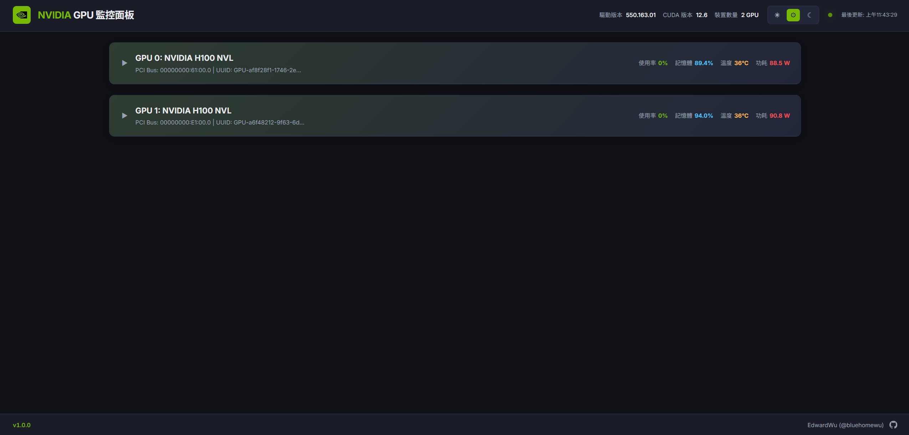
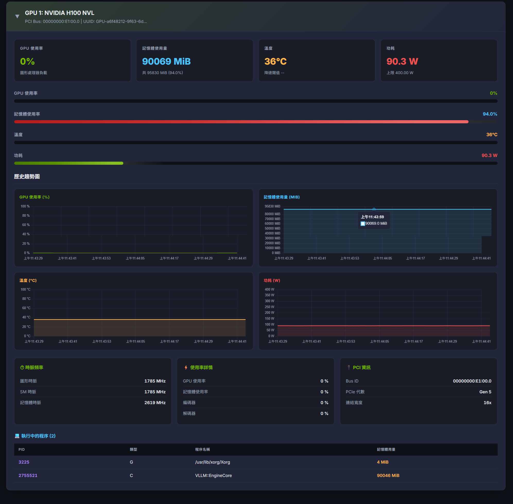

# NVIDIA GPU 監控面板

基於 `nvidia-smi` 的即時網頁版 NVIDIA GPU 監控面板。


## 截圖展示

| 多 GPU 總覽（折疊） | GPU 詳細監控（展開） |
|:---:|:---:|
|  |  |

## 功能特色

- **即時監控** - 每 3 秒自動更新數據
- **多 GPU 支援** - 自動偵測並顯示所有 NVIDIA GPU
- **歷史趨勢圖表** - GPU 使用率、記憶體、溫度、功耗的折線圖（Chart.js）
- **深色 / 淺色 / 自動主題** - 可跟隨系統設定或手動切換，透過 cookie 記憶偏好
- **可折疊 GPU 卡片** - 多 GPU 時預設折疊，附摘要列；展開狀態透過 cookie 保存
- **程序列表** - 顯示執行中的程序，包含 PID、類型、名稱與記憶體用量
- **正體中文介面** - 完整 zh-TW 使用者介面
- **多主機監控** - 透過設定介面加入區域網路內其他主機，集中顯示所有 GPU 狀態
- **Docker 部署** - 一行指令即可部署，支援 GPU 直通
- **響應式設計** - 支援桌面與行動裝置
- **跨平台** - 支援 Linux（Docker / gunicorn）與 Windows（waitress / PM2）

## 監控指標

| 類別 | 指標 |
|------|------|
| 使用率 | GPU %、記憶體 %、編碼器、解碼器 |
| 記憶體 | 已用 / 總計 / 可用（MiB） |
| 溫度 | 目前溫度、降速閾值、最高閾值 |
| 功耗 | 即時功耗、功耗上限、最大上限 |
| 時脈 | 繪圖、SM、記憶體時脈速度 |
| PCI | Bus ID、PCIe 世代、連結寬度 |
| 程序 | PID、類型（C/G）、名稱、記憶體用量 |

## 環境需求

- 已安裝驅動程式的 NVIDIA GPU
- `nvidia-smi` 可在 PATH 中使用
- Python 3.10+（本機部署）或 Docker（容器部署）

## 部署方式

### 方式一：Docker（建議）

需先安裝 [NVIDIA Container Toolkit](https://docs.nvidia.com/datacenter/cloud-native/container-toolkit/install-guide.html)。

```bash
# 複製專案
git clone https://github.com/bluehomewu/nvidia-smi-dashboard.git
cd nvidia-smi-dashboard

# 建置並啟動
docker compose up -d --build
```

啟動後即可透過 `http://localhost:5000` 存取監控面板。

容器已設定 `restart: always`，主機重新開機後會自動恢復運行（需確保 Docker 已設定開機啟動）。

停止服務：

```bash
docker compose down
```

### 方式二：本機部署

```bash
# 複製專案
git clone https://github.com/bluehomewu/nvidia-smi-dashboard.git
cd nvidia-smi-dashboard

# 安裝相依套件
pip install -r requirements.txt

# 執行（開發模式）
python app.py

# 執行（正式環境 - Linux / macOS）
gunicorn --bind 0.0.0.0:5000 --workers 2 --threads 4 app:app

# 執行（正式環境 - Windows）
waitress-serve --host 0.0.0.0 --port 5000 --threads=8 app:app
```

啟動後即可透過 `http://localhost:5000` 存取監控面板。

### 方式三：PM2 管理（Windows）

適合 Windows 環境下的常駐服務管理與開機自啟動。

```bash
# 安裝 PM2（需先安裝 Node.js）
npm install -g pm2

# 啟動服務（在 cmd 中執行，不要使用 PowerShell）
cd E:\path\to\nvidia-smi-dashboard
pm2 start waitress-serve --interpreter none --name gpu-dashboard -- --host 0.0.0.0 --port 5000 --threads=8 app:app

# 儲存 PM2 程序列表
pm2 save

# 設定開機自啟動
npm install -g pm2-windows-startup
pm2-startup install
pm2 save
```

常用管理指令：

```bash
pm2 status                 # 查看服務狀態
pm2 logs gpu-dashboard     # 查看日誌
pm2 restart gpu-dashboard  # 重啟服務
pm2 stop gpu-dashboard     # 停止服務
pm2 delete gpu-dashboard   # 移除服務
```

更新版本（在 cmd 中執行）：

```bash
# 1. 停止並刪除舊服務
pm2 stop gpu-dashboard
pm2 delete gpu-dashboard

# 2. 拉取最新版本
cd E:\path\to\nvidia-smi-dashboard
git pull

# 3. 更新相依套件
pip install -r requirements.txt

# 4. 重新啟動服務
pm2 start waitress-serve --interpreter none --name gpu-dashboard -- --host 0.0.0.0 --port 5000 --threads=8 app:app

# 5. 儲存程序列表（確保開機自啟套用新版本）
pm2 save
```

## 專案結構

```
nvidia-smi-dashboard/
├── app.py                 # Flask 後端，解析 nvidia-smi XML 輸出
├── docker-compose.yml     # Docker Compose，含 GPU 裝置配置
├── Dockerfile             # 基於 nvidia/cuda 映像檔
├── requirements.txt       # Python 相依套件
├── static/
│   ├── css/style.css      # 主題樣式（深色/淺色/自動）、響應式排版
│   └── js/app.js          # 前端邏輯、圖表、主題與折疊狀態管理
└── templates/
    └── index.html         # 主頁面（正體中文）
```

## 設定項目

| 項目 | 預設值 | 位置 |
|------|--------|------|
| 更新間隔 | 3 秒 | `static/js/app.js`（`REFRESH_INTERVAL`） |
| 圖表歷史長度 | 60 筆資料點（約 3 分鐘） | `static/js/app.js`（`HISTORY_LENGTH`） |
| 伺服器連接埠 | 5000 | `docker-compose.yml` / `app.py` |

## 作者

**EdwardWu** ([@bluehomewu](https://github.com/bluehomewu))
